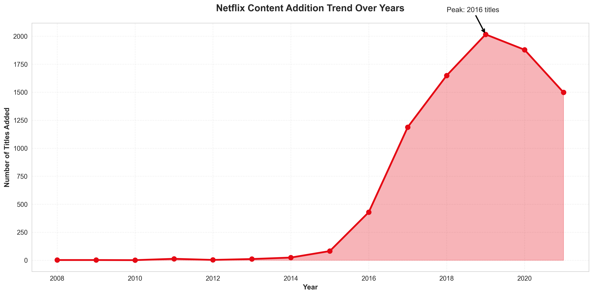
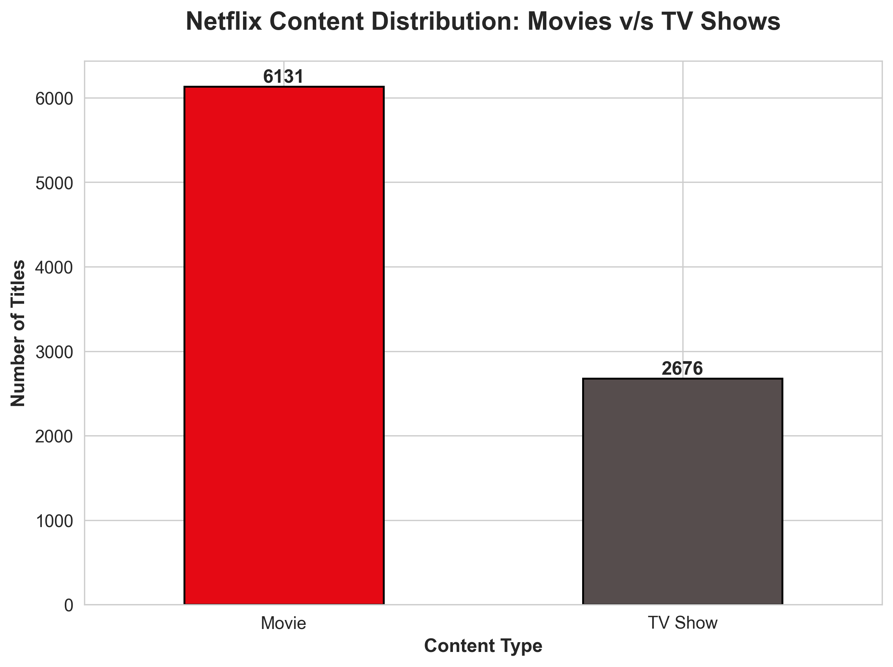
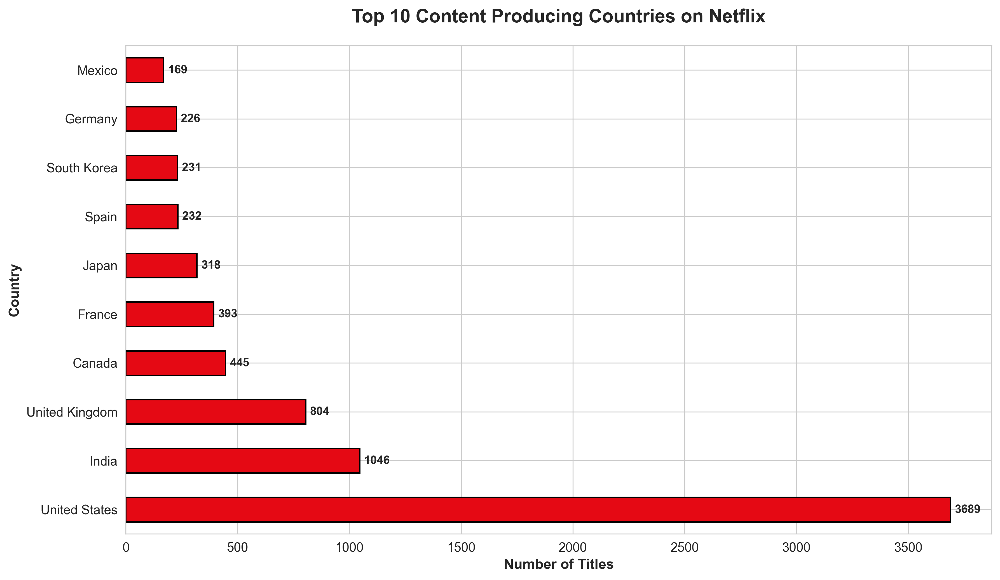
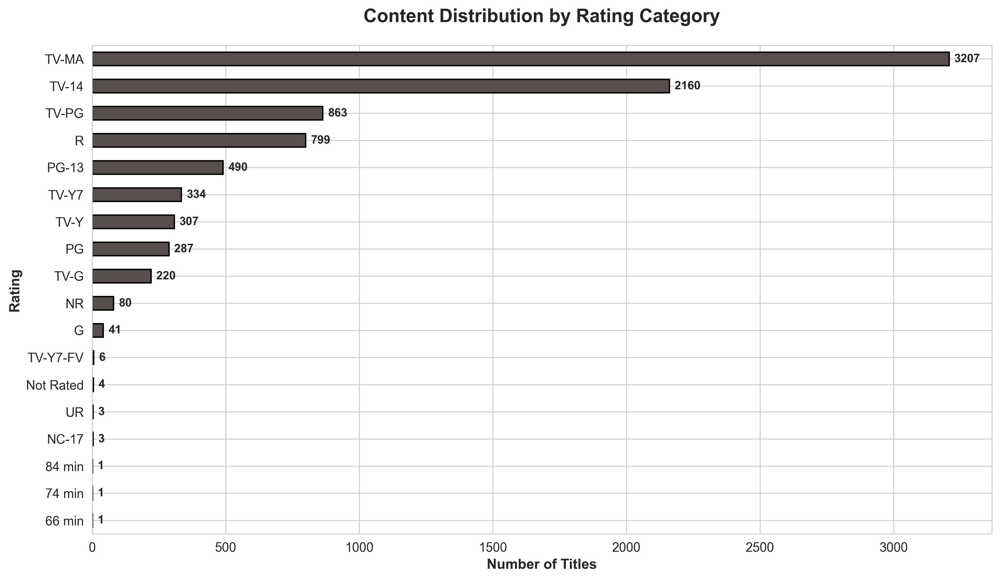
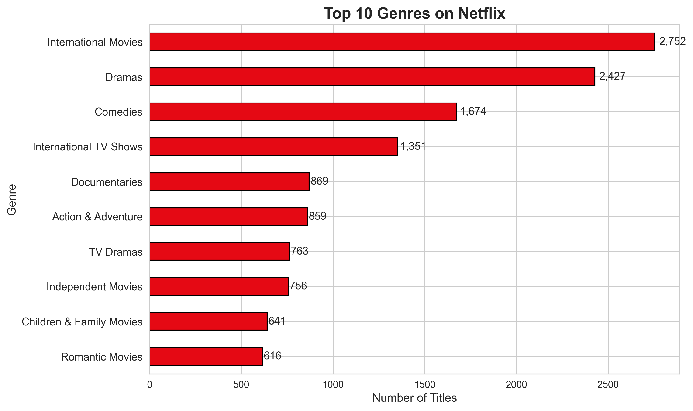

# 🎬 Netflix Content Analysis Dashboard



## 📊 Project Overview

Comprehensive data analysis of **8,000+ Netflix titles** revealing content distribution patterns, geographic trends, and strategic insights for the streaming entertainment industry.

**Live Analysis:** [Link to notebook or deployed dashboard]  

---

## 🎯 Objectives

- Analyze content distribution (Movies vs TV Shows)
- Identify top content-producing countries and regions
- Track content addition trends over time (2008-2021)
- Understand target audience demographics through rating analysis
- Discover genre preferences and content strategy patterns

---

## 🛠️ Tech Stack

| Category | Technologies |
|----------|-------------|
| **Language** | Python 3.12.9 |
| **Data Analysis** | Pandas, NumPy |
| **Visualization** | Matplotlib, Seaborn |
| **Environment** | Jupyter Notebook, VS Code |
| **Data Source** | Kaggle - Netflix Movies and TV Shows Dataset |

---

## ✨ Key Features

✅ **Comprehensive Data Cleaning** - Handled missing values, duplicates, date formatting  
✅ **5 Professional Visualizations** - Publication-quality charts with insights  
✅ **Statistical Analysis** - Trend identification and pattern recognition  
✅ **Business Intelligence** - Actionable recommendations for content strategy  
✅ **Well-Documented Code** - Reproducible analysis with clear explanations  

---

## 📈 Analysis Highlights

### 🎭 Content Distribution
- Analyzed **8807** total titles across movies and TV shows
- **69.6%** movies vs **30.4%** TV shows
- Reveals Netflix's strategic focus on movies

### 🌍 Geographic Insights
- Content production mapped across **127** countries
- **Top 3 Producers:** United States, India, United Kingdom
- Regional partnerships and expansion patterns identified

### 📅 Temporal Trends
- Content addition **peaked in 2019** with 2016 titles
- **-25.7% growth** in recent years showing negative growth
- Strategic expansion phases clearly visible

### 🎯 Audience Analysis
- Most common rating: **TV-MA** targeting mature audiences
- Genre diversity across **58** different categories
- Clear content strategy for mature audiences as well as families

---

## 📊 Visualizations

<details>
<summary>Click to view all visualizations</summary>

### 1. Content Type Distribution

*Analysis of Movies vs TV Shows split revealing content strategy*

### 2. Top 10 Content Producing Countries

*Geographic distribution showing key production partnerships*

### 3. Content Addition Timeline

*Temporal trends showing strategic expansion phases*

### 4. Rating Distribution

*Target audience demographics and content focus*

### 5. Top 10 Genres

*Genre preferences revealing content strategy*

</details>

---

## 💡 Key Findings

| # | Finding |
|---|---------|
| 1️⃣ | **6,131 Movies (69.6%) vs 2,676 TV shows (30.4%). Netflix has a strong preference for Movies** |
| 2️⃣ | **United States dominates with 3,689 titles. Top 3 countries: United States, India, United Kingdom. Top 3 represent 5,539 titles (55.3% of all content)** |
| 3️⃣ | **'International Movies' dominates with 2,752 titles. Top 3 genres: International Movies, Dramas, Comedies** |

**Detailed Analysis:** See [ANALYSIS.md](ANALYSIS.md) for comprehensive findings

---

## 🚀 How to Run This Analysis

### Prerequisites
```bash
# Install required packages
pip install pandas numpy matplotlib seaborn jupyter
```

### Steps
1. **Clone this repository**
```bash
   git clone https://github.com/fr0styyXD/netflix-analysis.git
   cd netflix-analysis
```

2. **Download dataset**
   - Get data from [Kaggle Netflix Dataset](https://www.kaggle.com/datasets/shivamb/netflix-shows)
   - Place `netflix_titles.csv` in `data/` folder

3. **Run analysis**
```bash
   jupyter notebook notebooks/analysis.ipynb
```

4. **View results**
   - All visualizations will be saved in `visualizations/`
   - Analysis summary available in `ANALYSIS.md`

---

## 📂 Project Structure
```
netflix-analysis/
│
├── data/
│   ├── netflix_titles.csv          # Raw dataset (not included)
│   └── netflix_cleaned.csv         # Cleaned data
│
├── notebooks/
│   └── analysis.ipynb              # Main analysis notebook
│
├── visualizations/
│   ├── viz1_content_type.png
│   ├── viz2_top_countries.png
│   ├── viz3_yearly_trend.png
│   ├── viz4_ratings.png
│   └── viz5_top_genres.png
│
├── ANALYSIS.md                      # Detailed findings & insights
├── README.md                        # This file
└── requirements.txt                 # Python dependencies
```

---

## 🎓 Skills Demonstrated

| Skill Category | Specific Skills |
|----------------|-----------------|
| **Data Analysis** | Data Cleaning, EDA, Statistical Analysis |
| **Programming** | Python, Pandas, NumPy |
| **Visualization** | Matplotlib, Seaborn, Chart Design |
| **Business Intelligence** | Insight Generation, Strategic Recommendations |
| **Documentation** | Technical Writing, Code Documentation |

---

## 🔍 Insights & Recommendations

### For Netflix:
- **Geographic Expansion:** Opportunity in underrepresented regions like Mexico, Germany, South Korea, Japan
- **Content Gaps:** Huge chunk of Netflix is Movies covering almost 69.4% of the app
- **Audience Targeting:** Mature Audiences mostly using TV-MA and also a huge chunk of family friendly options with movies and TV Shows

### For Content Creators:
- Focus on **International Movies** that Netflix actively acquires
- Target **United States** for co-production opportunities
- Create **Movies** aligned with platform strategy

---

## 🔮 Future Enhancements

- Interactive dashboard using Streamlit
- Sentiment analysis on titles and descriptions
- Actor/Director network analysis
- Predictive modeling for content success
- Time series forecasting for content trends

---

## 📧 Contact & Connect

**Aksh Dhingra**  
🎓 Computer Science Graduate | Data Analyst | Python Developer

📧 Email: workdhingra26@gmail.com  
💼 LinkedIn: [Aksh Dhingra](https://linkedin.com/in/akshdhingra)  
🐙 GitHub: [fr0styyXD](https://github.com/fr0styyXD)  

---

[⬆ Back to Top](#-netflix-content-analysis-dashboard)

</div>

